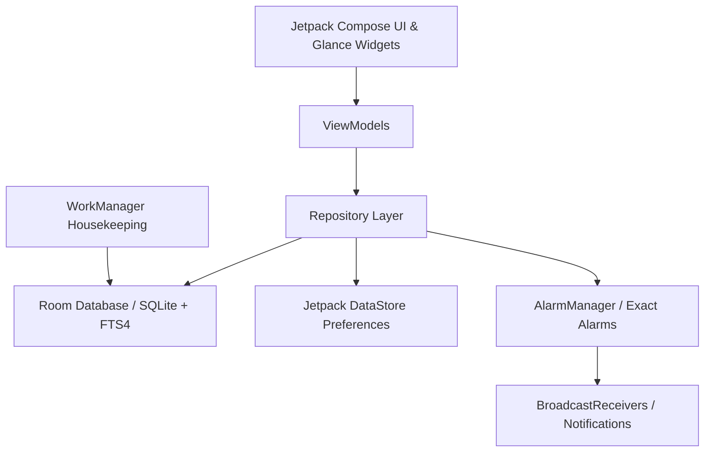

# LOR TO-DO Architecture Overview

**LOR TO-DO** is engineered according to Android Modern App Architecture guidelines, adhering to strict offline-first principles, unidirectional data flow (UDF), and clean modular separation.

## Architectural Layers

### 1. Presentation Layer (`org.lortodo.ui`)
- **Jetpack Compose + Material 3**: Fully declarative UI with dynamic theming (Material You), AMOLED Black mode, and warm customizable palettes.
- **TopHeader & DateStrip**: Cheerful, minimalist header featuring a greeting and horizontal date selector strip inspired by modern, distraction-free productivity tools.
- **Quick-Add Bar**: Persistent docked input bar providing instant (< 3 seconds) task capture with live rule-based natural language parsing.
- **Glance AppWidgets**: Home screen widgets built with AndroidX Glance providing interactive task completion and quick add.

### 2. ViewModel Layer
- Exposes immutable `StateFlow<UiState>` models to Compose.
- Interacts exclusively with Domain Repositories and Use Cases.
- Never directly accesses Android OS services or database tables.

### 3. Domain Layer (`org.lortodo.domain`)
- **Pure Models**: `Task`, `Subtask`, `TaskList`, `Tag`, `Reminder`, `FocusSession`.
- **Recurrence Engine (`RecurrenceEngine`)**: Deterministic recurrence calculation supporting daily, weekly, monthly, and custom frequencies with repeat-from-due or repeat-from-completion semantics.
- **Natural Language Parser (`NaturalLanguageTaskParser`)**: 100% offline rule-based parser that extracts date, time, priority (`!high`), tags (`#bills`), and recurrence (`every month`) without network calls or external AI SDKs.

### 4. Data Layer (`org.lortodo.data`)
- **Room Database (`AppDatabase`)**: Encapsulates SQLite tables, indexes, cascading foreign keys, and FTS4 virtual tables (`tasks_fts`) for sub-100ms full-text searches.
- **DataStore Preferences**: Typed, asynchronous, and reactive configuration storage.
- **Backup Manager (`BackupManager`)**: Open-standard JSON export/import with versioning, CSV export/import (compatible with spreadsheet software and Todoist), and formatted Markdown export.

### 5. Reminders & Background Processing (`org.lortodo.reminders`, `org.lortodo.service`)
- **AlarmManager Exact Alarms**: Reliable notifications using `setExactAndAllowWhileIdle` and notification channels.
- **BootReceiver**: Automatically reschedules active alarms after system reboot or app update.
- **TrashPurgeWorker**: Periodic WorkManager worker that purges deleted tasks after 30 days.
